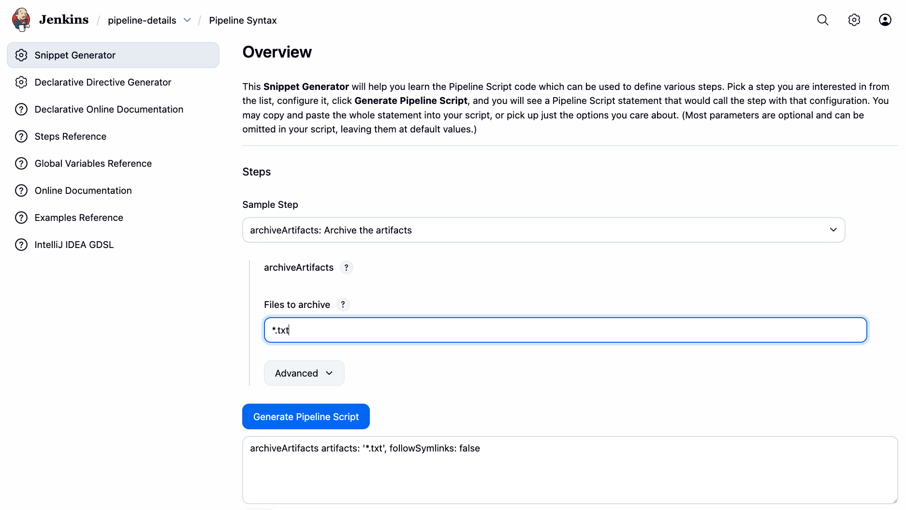

# 01_03 Use the Pipeline Snippet Generator

Jenkins provides a pipeline snippet generator that can create snippets of code for use in pipeline configurations.

Find the syntax generator by clicking the **Pipeline Syntax** link at the bottom of the pipeline editor or by opening **YOUR_JENKINS_SERVER_URL/pipeline-syntax**.

<!-- FooterStart -->
---
[← 01_02 Use Build Steps in a Pipeline](../01_02_use_build_steps_in_a_pipeline/README.md) | [01_04 Use Variables In a Pipeline →](../01_04_use_variables_in_a_pipeline/README.md)
<!-- FooterEnd -->
